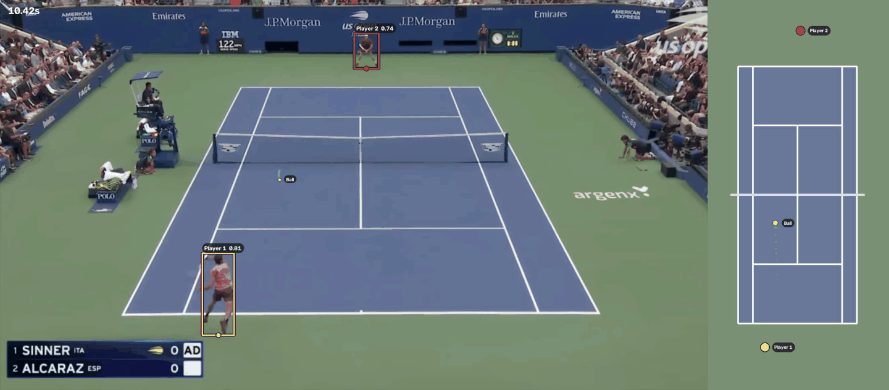

# CourtVision

CourtVision tracks the two active players and the ball in tennis footage, then maps the
rally onto a top-down court.

This is an enhanced version of a UCLA Tennis Consulting project I led. It builds on that
work with camera-aware court calibration, steadier player positioning, and estimated ball
movement between frames.

## Demo



The broadcast view shows the detections used by the tracker. The court view shows the same
rally from above, including player movement and the ball's estimated path through the air.

## What it does

- calibrates the visible court from four baseline corners
- follows the near and far players as the broadcast camera moves
- detects the tennis ball and fills short gaps using the surrounding frames
- maps airborne shots and observed bounces onto a normalized court
- exports an annotated video and frame-by-frame JSONL events

## Development

CourtVision requires Python 3.11 through 3.14 and
[uv](https://docs.astral.sh/uv/). Install the project and run its checks with:

```bash
make install
make lint
make test
```

The pipeline accepts MP4 or MOV footage. Local clips and calibration files belong in
`data/sample/`; generated videos and events are written to `data/processed/`.

```bash
make process-video
make track-video VIDEO=data/sample/sample.mov
```

Ball tracking uses TrackNet tennis weights at `models/tracknet-tennis.pt`.

## Project structure

```text
services/vision/src/courtvision/
├── court/           # calibration models and file loading
├── ball/            # tennis-ball candidate detection
├── geometry/        # image/court perspective transforms
├── players/         # person detection and active-player selection
├── tracking/        # persistent tracks and event schemas
├── video/           # timestamp-aware frame ingestion
└── visualization/   # normalized court and calibration previews
```
